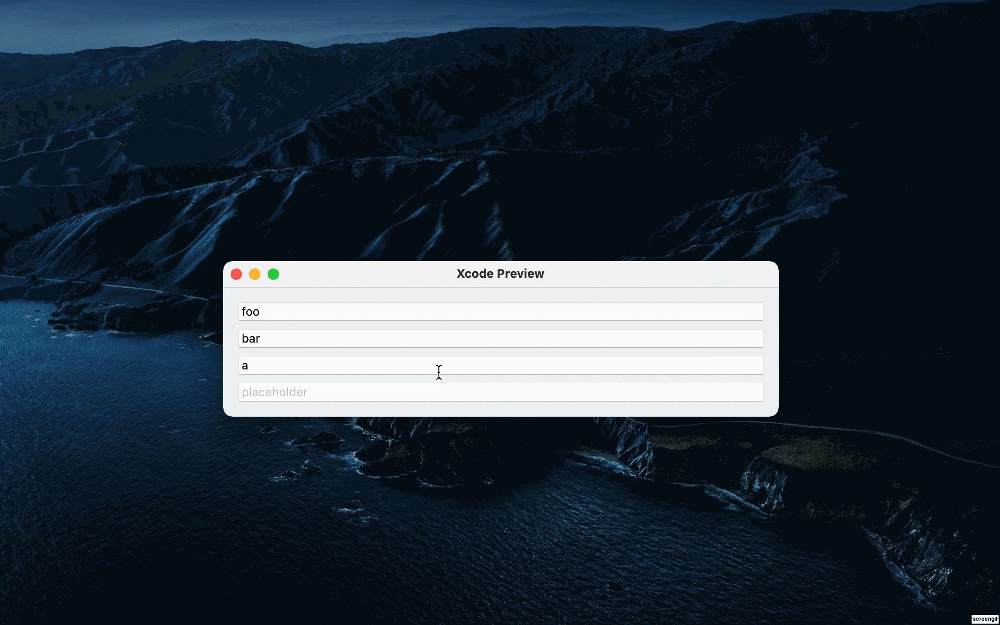

# RecursiveTextField

Create a group of ``TextField``  that will recursively grow as new data are entered. 

This view will automatically remove emptied `TextField`, so only one empty `TextField` filled with `placeholder` will be displayed at the bottom.



## Example

The following example shows a `RecursiveTextField` was created with an empty `textList`, one `TextField` will be created with *"Placeholder"* being the description:

```
@State var textList: [String]
RecursiveTextField($textList)
```
The following example shows a `RecursiveTextField`, where three `TextField` will be created, with the first two pre-filled with `"foo"` and `"bar"`:
```
@State var textList: [String] = ["foo", "bar"]
RecursiveTextField(textList: $textList, placeholder: "Input...")
```

## Initializers

`init(_ textList: Binding<[String]>)`

`init(textList: Binding<[String]>, placeholder: String = "Placeholder")`

### Parameters

-   `_ textList`/`textList`: An array of `String` that will be modified through `TextField`.

-   `placeholder [optional]`: Default text to be displayed when no text was entered to `TextField` yet.

